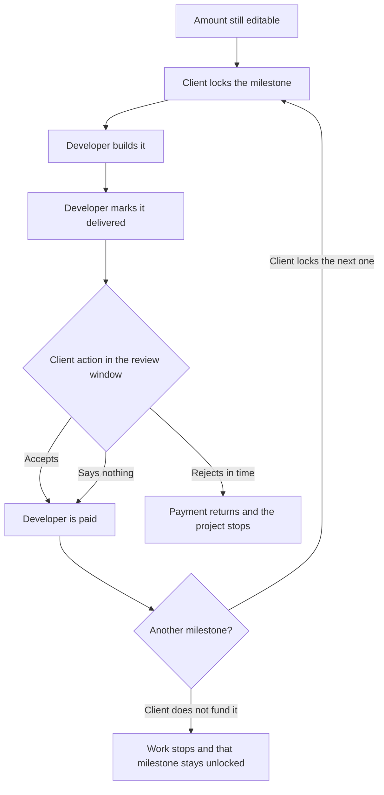
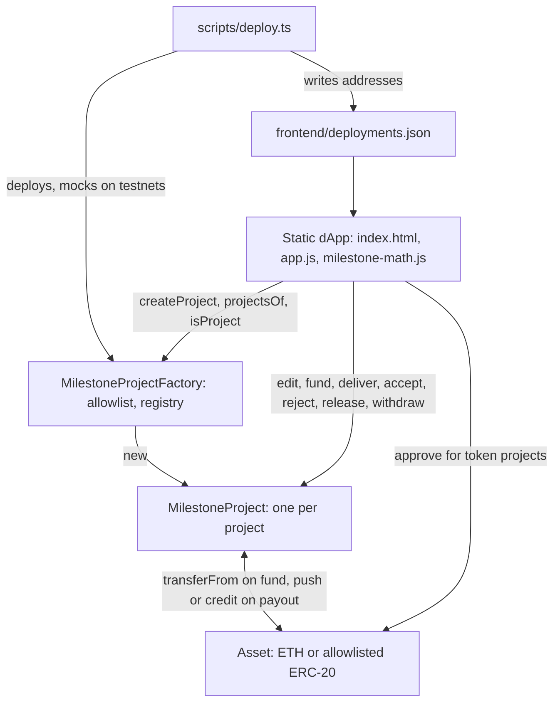
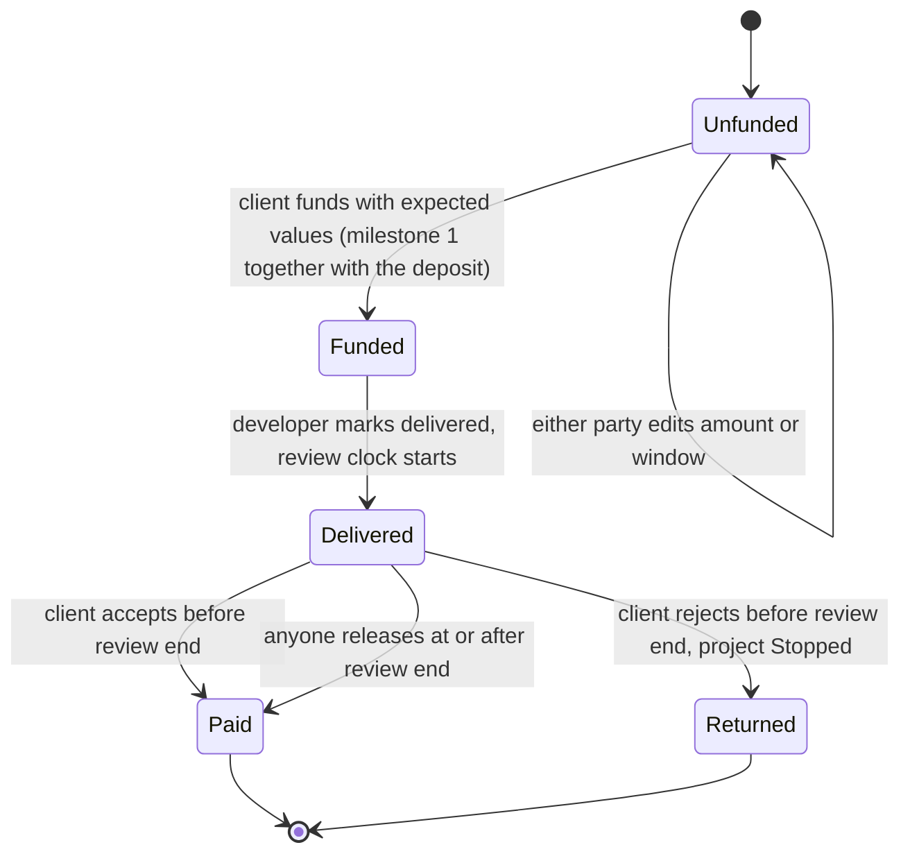
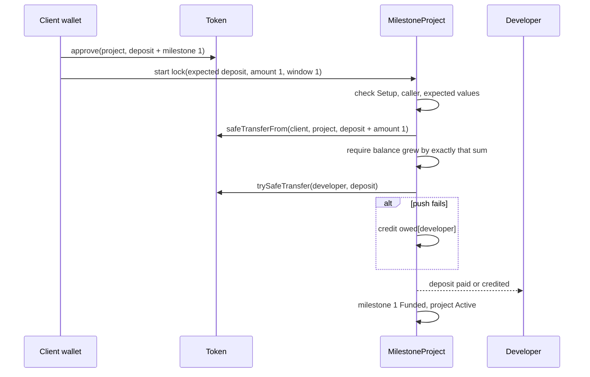

# Milestone Payments - Plan

## Goal Capsule

- **Objective:** The developer can run an agreed software project for a client without the bulk of the fee sitting unpaid in a final invoice the client can ignore.
- **Means:** A per-project milestone escrow contract created through a factory with a fixed five-asset allowlist, driven from the existing static dApp page (KTD1, KTD2, KTD10).
- **Product authority:** The developer is the repo owner. This plan owns how that developer and a client who already agreed on scope and milestones pay for one project. Similar project work is in scope. Finding clients is not.
- **Authority hierarchy:** Product Contract R-IDs win on behavior. KTDs win on mechanism within those R-IDs. Implementation Units override neither.
- **Execution profile:** Deep. Contract units (U2, U3, U4) are built test-first because they hold real funds.
- **Stop conditions:** Stop and report instead of improvising if any of these happens:
  - A settled Key Decision proves infeasible in code.
  - The project contract cannot fit the 24,576-byte deployed-code limit with the optimizer on, which would reopen KTD1.
  - The mainnet token metadata check in U6 does not match the addresses in Sources & Research.
- **Who finishes and ships:** `ce-work` implements U1 through U8 and opens the pull request. The Sepolia and mainnet deployments are operator steps the developer runs after review, per Operational Notes.
- **Open blockers:** None.

---

## Product Contract

### Summary

The developer and a client who already agreed on scope use the app to pay for one software project.
The client locks the deposit before any work, then locks each milestone in one asset before that milestone is built.
Accepting a delivered milestone pays the developer then.
If the client does not reject before the review window ends, the developer is paid when the window ends.
A rejection in time returns that milestone and stops the project.

### Problem Frame

The developer is the repo owner.
The first user is the developer, for a website project or similar work already in hand.
There is no observed paying user.
The app was a learning project.
The developer already has the client and the project.

On a past contract, the last payment was most of the money.
After delivery, the client could have not paid.
The developer does not want to be at the mercy of a client whose honesty is uncertain.

`contracts/WorkContract.sol` is one ETH agreement, and the deploying account is the client.
The agreement stores a worker, an hourly rate, hours required, a guaranteed amount, an ideal deadline, and a max deadline.
It stores no milestone list and no scope text.
Full payment is released only when both parties have approved.
The worker then receives `hourlyRate * hoursRequired`, and any surplus returns to the client, in `approveCompletion`.
If only the worker has approved, the worker can claim `guaranteedAmount` and the rest returns to the client, in `claimGuaranteed`.
After `maxDeadline`, `workerClaimAfterDeadline` pays the worker the full balance if the client has not approved.
`clientClaimAfterDeadline` pays the client the full balance if the worker has not approved.
The agreement holds native ETH only.
The repo has no wBTC, USDT, USDC, or USDS.
`frontend/index.html` connects a wallet, takes a contract address, and can approve, claim the guaranteed amount, run the deadline claims, and read the balance.
That page has no flow for creating an agreement and no milestone UI.
`deployments.md` records a Sepolia deployment and a local address, and no mainnet deployment.

### Key Decisions

- **Deposit is a start fee.** (session-settled: user-approved — chosen over holding the deposit until the project ends, and over crediting it toward the price: it pays the developer for taking the work and for finding out the client will not accept delivery.) Governs R1, R2, R3, R4.
- **Fund milestones one at a time.** (session-settled: user-approved — chosen over funding every milestone up front, and over one pot drawn down as milestones are accepted: stopping never has to refund later milestones, and the payment is locked while the work is being built.) Governs R4, R5, R6, R7, R8, R9, R11.
- **Rejection returns that milestone and stops the project.** (session-settled: user-approved — chosen over a forced split, and over leaving the money locked until both agree: a forced split lets the client buy a discount by disputing, and locked funds do not tell the developer to stop.) Governs R4, R11, R17, R18.
- **An unanswered delivery pays the developer.** (session-settled: user-directed — chosen over returning the money when the client never accepts, and over leaving it locked until an explicit accept or reject: the developer is not waiting on a client who goes quiet after delivery.) Governs R19.
- **Acceptance pays the developer before the window ends.** (session-settled: user-approved — chosen over holding every payment until the window ends: the next milestone can be funded without burning the full review time.) Governs R20.
- **The parties set the milestone amounts.** (session-settled: user-directed — chosen over the app requiring an equal split, and over the app requiring each milestone to be smaller than the one before: even slices keep one refusal from being the bulk of the money, and the parties already agree the amounts.) Governs R12, R13, R14, R15.
- **One asset for the project.** (session-settled: user-approved — chosen over any popular coin the parties name, and over mixing assets on one project: an open-ended coin list has no finish line.) Governs R26.
- **A locked amount is not repriced.** (session-settled: user-directed — chosen over the app keeping a milestone matched to an agreed dollar figure: the locked asset is what gets paid or returned.) Governs R27, R28.

### Actors

- A1. Developer. Sets up the payments per R16, builds a milestone only after it is locked per R7, and marks that milestone delivered.
- A2. Client. Agrees scope and milestone meanings before a milestone is marked delivered, per R22. Funds what the developer set up, per R16. Accepts or rejects a delivered milestone per R20 and R17.

### Requirements

**Start fee**

- R1. The client locks the deposit before any work starts.
- R2. The locked deposit belongs to the developer immediately.
- R3. The deposit is charged in addition to the milestone amounts.
- R4. The developer keeps the deposit if the client rejects a milestone or will not fund the next one.

**One milestone at a time**

- R5. The client locks milestone 1 before any work starts.
- R6. The client funds each later milestone only after the previous milestone has been paid.
- R7. The client locks each milestone before the developer builds it.
- R8. When the client will not fund the next milestone, work stops.
- R9. A milestone the client does not fund stays unlocked.
- R10. The parties choose how many milestones the project has.
- R11. The developer keeps every milestone already paid if the client rejects a later milestone or will not fund the next one.

**Amounts**

- R12. The developer and the client set each milestone amount.
- R13. Until a party changes the amounts, each milestone defaults to an even split of the work total after the deposit.
- R14. Either party may change the deposit or a milestone amount only before that amount is locked.
- R15. The app accepts milestone amounts that are unequal, including a milestone larger than the previous one.
- R16. The developer sets up the payments and the client funds them.

**Delivery and review**

- R17. If the client rejects a milestone before its review window ends, that payment returns to the client.
- R18. The project stops when the client rejects a milestone before its review window ends.
- R19. If the developer marks a milestone delivered and the client does not reject it before the review window ends, the developer is paid that milestone.
- R20. If the client accepts a delivered milestone before the review window ends, the developer is paid that milestone then.
- R21. Before a milestone is locked, the two parties set that milestone's review-window duration, which is not a single duration for every project.
- R22. The parties agree what the project covers and what each milestone means before the developer marks that milestone delivered.
- R23. The client checks a delivered milestone by rejecting it inside the review window.
- R24. No referee, oracle, or arbitrator decides whether a milestone was done.
- R25. The app does not require a deliverable upload before a milestone is paid or returned.

**Asset**

- R26. The parties use one asset for every payment on the project, chosen from ETH, wBTC, USDT, USDC, or USDS.
- R27. The app pays or returns the locked quantity of that asset unchanged when the dollar value moves.
- R28. Dollar stability is the parties' choice of USDT, USDC, or USDS.

### Key Flows

One milestone follows the path below.
The deposit is locked with milestone 1 before any work, per R1 and R5, and it belongs to the developer from that lock, per R2.



- F1. Open the project
  - **Trigger:** A1 and A2 have agreed scope and milestone meanings, per R22.
  - **Actors:** A1, A2
  - **Steps:** A1 sets up the payments per R16, including one asset per R26, the milestone count per R10, the amounts per R12 and R13, and each review-window duration per R21. Either party may change an unlocked amount per R14. A2 locks the deposit and milestone 1 before any work per R1 and R5.
  - **Outcome:** The deposit belongs to A1 per R2 and R3. A1 may build milestone 1 only after it is locked per R7.
- F2. Review a delivered milestone
  - **Trigger:** A1 has built the locked milestone.
  - **Actors:** A1, A2
  - **Steps:** A1 marks the milestone delivered. The review window starts then, as stated in Dependencies, using the duration in R21. A2 may accept per R20 or reject before the window ends per R17. If A2 does neither, A1 is paid when the window ends per R19. What the client must do, and what the app must not require, is R23, R24, and R25.
  - **Outcome:** Accept or silence pays A1 that milestone per R20 and R19. A rejection returns it to A2 and stops the project per R17 and R18. A1 keeps the deposit and milestones already paid per R4 and R11.
- F3. Fund the next milestone or stop
  - **Trigger:** A milestone has been paid by acceptance or by silence.
  - **Actors:** A1, A2
  - **Steps:** A2 may lock the next milestone only after that payment per R6, and must lock it before A1 builds it per R7. An unlocked amount may still be changed per R14. If A2 will not fund the next milestone, work stops per R8.
  - **Outcome:** If A2 locks the next milestone, A1 builds it only after that lock per R7. If A2 will not fund it, work stops per R8 and that milestone stays unlocked per R9. A1 keeps the deposit and paid milestones per R4 and R11.

### Acceptance Examples

- AE1. Rejection returns the milestone under review and keeps the deposit
  - **Covers R2, R4, R17, R18.**
  - **Given:** The deposit is locked and milestone 1 is delivered, inside its review window.
  - **When:** The client rejects milestone 1 before the window ends.
  - **Then:** Milestone 1 returns to the client, the project stops, and the developer still has the deposit.
- AE2. A later rejection keeps milestones already paid
  - **Covers R4, R11, R17, R18.**
  - **Given:** The deposit and milestone 1 are already paid to the developer, and milestone 2 is delivered inside its review window.
  - **When:** The client rejects milestone 2 before the window ends.
  - **Then:** Milestone 2 returns to the client, the project stops, and the developer keeps the deposit and milestone 1.
- AE3. Silence pays the developer
  - **Covers R19.**
  - **Given:** A milestone is locked, the developer has marked it delivered, and the client has not rejected it.
  - **When:** The review window ends.
  - **Then:** The developer is paid that milestone.
- AE4. Acceptance pays before the window ends
  - **Covers R20.**
  - **Given:** A milestone is delivered and its review window is still open.
  - **When:** The client accepts it.
  - **Then:** The developer is paid that milestone then.
- AE5. The client does not fund the next milestone
  - **Covers R4, R8, R9, R11.**
  - **Given:** Milestone 1 has been paid and milestone 2 is not locked.
  - **When:** The client will not fund milestone 2.
  - **Then:** Work stops, milestone 2 stays unlocked, and the developer keeps the deposit and milestone 1.
- AE6. Amounts may be unequal or larger later
  - **Covers R14, R15.**
  - **Given:** The milestone amounts are not locked yet.
  - **When:** The parties set a milestone larger than the previous one.
  - **Then:** The app accepts those amounts.
- AE7. The default is an even split until someone edits it
  - **Covers R13.**
  - **Given:** The work total after the deposit divides evenly by the milestone count, and neither party has changed an amount.
  - **When:** The payments are set up.
  - **Then:** Each milestone amount is that even share of the work total.
- AE8. An amount can change only before it is locked
  - **Covers R14.**
  - **Given:** One amount on the project is still unlocked and another is already locked.
  - **When:** Either party changes the unlocked amount and attempts to change the locked amount.
  - **Then:** The unlocked amount changes and the locked amount stands.
- AE9. The dollar price does not change a locked quantity
  - **Covers R27, R28.**
  - **Given:** A milestone is locked in ETH.
  - **When:** The dollar value of ETH moves before that milestone is paid or returned.
  - **Then:** The party who receives it receives the locked quantity of ETH.
- AE10. Each milestone can have its own review duration
  - **Covers R21.**
  - **Given:** Two milestones are not locked yet.
  - **When:** The parties set a different review-window duration on each before lock.
  - **Then:** Each milestone uses the duration set for it.
- AE11. Payment does not wait on a referee or an upload
  - **Covers R19, R23, R24, R25.**
  - **Given:** The developer has marked a milestone delivered. The client has uploaded no file, and no third party has ruled on the work.
  - **When:** The review window ends with no rejection.
  - **Then:** The developer is paid that milestone.

### Scope Boundaries

**Deferred for later**

- An asset other than the set in R26. Adding one is later.

**Outside this product's identity**

- Finding clients, a job board, or a marketplace.
- A referee, an oracle, or an arbitrator, per R24.
- A deliverable upload as a payment gate, per R25.
- A second asset on the same project, per R26.
- The app requiring equal milestone amounts, or requiring each milestone to be smaller than the one before, per R15.
- Repricing a locked amount into dollars, per R27.
- Hardening the approval, guaranteed-claim, and whole-balance deadline claims in `contracts/WorkContract.sol`. Those rules are replaced.
- KYC, a platform fee, notifications, and upgradeability.

#### Deferred to Follow-Up Work

- A developer action that returns a locked, undelivered milestone to the client and stops the project. It would unstick client funds when the developer walks away, but it moves an amount the Dependencies below say stays locked, so it needs the developer's product approval first.
- An independent security review of `contracts/MilestoneProject.sol` before mainnet projects hold meaningful sums.
- Listing a project's edit history in the dApp from contract events. The current amounts are what the client locks, so history is a convenience.

### Dependencies / Assumptions

- The review window starts when the developer marks that milestone delivered. Its length is the duration in R21. The window does not start when the client locks the milestone.
- A funded milestone the developer has not marked delivered stays locked. No separate delivery deadline moves that amount.
- The client can reject only during the open review window, after delivery is marked and before the window ends.
- The project includes a deposit and at least one milestone. The parties choose that count per R10.
- The work total is the figure R13 splits. After a party changes an amount, the app does not force the milestone amounts to sum to that figure.

---

## Planning Contract

**Product Contract preservation:** restructured, no scope change. The Problem Frame's approximate `WorkContract.sol` line citations now name the functions instead, because the lines moved on the current branch. The deferred question on where an uneven split's remainder goes is resolved by KTD4 and removed from Outstanding Questions. Deferred to Follow-Up Work is new and holds only plan-local follow-ups.

### Key Technical Decisions

- KTD1. **One contract per project, deployed by a factory that also keeps a registry.** `MilestoneProjectFactory` creates each `MilestoneProject` with `new`, records it in `isProject`, and lists it for both parties in `projectsOf`. Separate contracts keep each project's funds and accounting apart, so a bug or stuck balance on one project cannot touch another. They also match the repo's existing one-agreement-per-contract shape. A singleton escrow holding every project was rejected because it pools funds across projects. EIP-1167 clones were rejected because they add initializer risk to save gas that does not matter at one-project scale. This did not need a bake-off, because the three shapes are concrete enough to judge without further development.
- KTD2. **The asset allowlist is fixed when the factory is deployed, with no admin.** The factory constructor takes the wBTC, USDT, USDC, and USDS addresses for its network, and native ETH is the zero address. `createProject` rejects any other asset, and nobody can change the list afterwards. (session-settled: user-approved — chosen over any popular coin the parties name, and over mixing assets on one project: an open-ended coin list has no finish line.) Governs R26. **Conflict call-out:** USDT and USDC issuers can freeze an address, and USDT has a dormant transfer-fee switch. Both are workable under KTD8 and KTD9. A frozen party's payout waits as a credit, and a fee-charging token cannot be funded at all.
- KTD3. **The contract stores explicit per-milestone amounts and windows and checks only that each amount is above zero.** There is no equality, ordering, or sum check. Either party may change the deposit before the start lock, and either party may change an unfunded milestone's amount or window. (session-settled: user-directed — chosen over the app requiring an equal split, and over the app requiring each milestone to be smaller than the one before: even slices keep one refusal from being the bulk of the money, and the parties already agree the amounts.) Governs R12, R14, R15, R21.
- KTD4. **The default split gives any remainder to milestone 1, and the dApp computes it.** The dApp asks for the work total without the deposit, per R3. Each milestone gets `floor(total / count)` in the asset's base units, and milestone 1 also gets `total mod count`. The defaults then sum exactly to the work total. The extra lands on the milestone the client locks with the deposit, before any work starts. The remainder is always smaller than the milestone count in base units, such as wei or a millionth of a USDC, so no party can notice it. The contract never sees the work total. It only stores the amounts the developer submits under KTD3. Resolves the R13 remainder question.
- KTD5. **Every funding call states the amounts and window the client saw.** The start lock takes the expected deposit, milestone 1 amount, and milestone 1 window. Funding a later milestone takes its expected amount and window. The call reverts if any of them changed. Without this, the other party could edit an amount between the client reading it and the client's transaction landing, and the client would lock a figure they never agreed to. The developer needs the same protection against the client. Every edit to the deposit or to a milestone amount or window increments a `termsVersion`. A developer edit also moves `confirmedVersion` up to match, but a client edit does not. The start lock and fund-next calls revert while `confirmedVersion` is behind `termsVersion`. The developer clears that by calling confirm terms with the version they reviewed, which reverts if it is no longer current. Either party can still edit before lock, as KTD3 requires, but the client can never lock terms the developer has not seen. That keeps R16, where the developer sets up the payments and the client funds them. It also stops the client from cutting the start fee behind R4 just before locking. Supports R1, R4, R5, R7, R14, R16.
- KTD6. **The start lock pays the deposit to the developer in the same transaction.** The project takes the deposit plus milestone 1, sends the deposit on at once under KTD8, and holds only milestone 1. No code path ever returns a deposit. Instantiates the start-fee Key Decision, which governs R1, R2, R3, R4.
- KTD7. **The review clock is half-open and anyone can trigger the silent payout.** Marking a milestone delivered records `deliveredAt`, and the review ends at `deliveredAt + reviewWindow`. The client can accept or reject only while the block time is before that end. From the end onwards, any account can call release, which pays the developer. Exactly one of the two outcomes is ever available, and the developer never needs the client to act. This matches the boundary tests in `test/WorkContract.test.ts`, where a timestamp equal to the deadline is not yet past it. (session-settled: user-directed — chosen over returning the money when the client never accepts, and over leaving it locked until an explicit accept or reject: the developer is not waiting on a client who goes quiet after delivery.) Governs R17, R19, R20, R23.
- KTD8. **Payouts push first, credit on failure, and settle only from recorded amounts.** A push that fails credits `owed[recipient]`. No aggregate counter is kept, because nothing in this design reads the balance to decide a payout. ETH uses a `call`, and tokens use `SafeERC20.trySafeTransfer`. The recipient pulls a credit later with `withdraw`. A reverting or frozen recipient therefore cannot block the other party's settlement. Payout amounts always come from stored milestone amounts, never from the contract's balance, so ETH or tokens sent to the contract directly are never paid out. That rule carries forward the lesson of the current branch's `fundedAmount` and `reservedWithdrawals` fixes in `contracts/WorkContract.sol`.
- KTD9. **Token handling uses OpenZeppelin Contracts 5.6.x, checks that the full amount arrived, and is non-reentrant.** Funding uses `SafeERC20.safeTransferFrom`, which handles USDT's missing return value. It also measures the project's token balance before and after the transfer and reverts unless it grew by exactly the expected amount, which rejects fee-on-transfer behavior. An ETH project requires the exact `msg.value`, and a token project requires `msg.value` to be zero. Every state-changing external function uses `ReentrancyGuard` and updates state before any external call. The non-transient guard is used so the contract does not depend on a particular EVM version.
- KTD10. **The dApp stays a static, build-free page using ethers v5.** The inline script moves into `frontend/app.js`, and the split and amount logic moves into `frontend/milestone-math.js` so mocha can test it. The page reads factory and token addresses per chain from `frontend/deployments.json`, which the deploy script writes. It opens only projects that the network's factory reports in `isProject`. The existing wallet-connection, `escapeHtml`, and `showResult` code is reused as is. A framework or bundler was rejected because Netlify publishes `frontend/` with no build step, and the page has one user.
- KTD11. **Testnets use mock tokens, and a mainnet deploy checks the real tokens first.** On local and Sepolia, the deploy script deploys mocks:
  - An 8-decimal wBTC mock.
  - A 6-decimal USDC mock.
  - An 18-decimal USDS mock.
  - A 6-decimal USDT mock that returns nothing from `transfer`.

  On chain 1 it refuses to deploy mocks. Before it deploys the factory, it reads `symbol()` and `decimals()` from each canonical address in Sources & Research and aborts on any mismatch.
- KTD12. **Stopping needs no on-chain action from the client.** A rejection sets the project to `Stopped` and blocks every later edit and funding call. When the client simply does not fund the next milestone, the project stays `Active`, that milestone stays `Unfunded`, and nothing is locked. That state is how the contract represents "work stops" under R8 and R9. Instantiates the fund-one-at-a-time Key Decision, which governs R6, R8, R9, R11.

### High-Level Technical Design

**Components and calls.**



**Milestone lifecycle.** The project status is `Setup` until the start lock, then `Active`. A rejection makes it `Stopped`. Paying the last milestone makes it `Completed`.



**Operations.** This table is directional. Exact names and argument order are left to the implementer.

| Operation | Caller | Precondition | Effect |
|---|---|---|---|
| Create project (factory) | Developer | Client is not zero and not the developer. Asset is allowlisted. Deposit is above zero. There are 1 to 50 milestones. Every amount is above zero. Every window is above zero and at most 365 days. | Deploys the project and registers it for both parties. |
| Edit deposit | Either party | Project is in `Setup`. New value is above zero. | Updates the deposit, increments `termsVersion`, and emits an event. A developer edit also sets `confirmedVersion` to it (KTD5). |
| Edit milestone amount or window | Either party | The milestone is `Unfunded`. Project is not `Stopped` or `Completed`. Bounds as at creation. | Updates it, increments `termsVersion`, and emits an event. A developer edit also sets `confirmedVersion` to it (KTD5). |
| Confirm terms | Developer | Project is not `Stopped` or `Completed`. The given version equals `termsVersion`. | Sets `confirmedVersion` to `termsVersion` and emits an event. |
| Start lock | Client | Project is in `Setup`. Expected values match and `confirmedVersion` equals `termsVersion` (KTD5). Exact value arrives (KTD9). | Pays the deposit to the developer (KTD6). Milestone 1 becomes `Funded`. Project becomes `Active`. |
| Fund next milestone | Client | Project is `Active`. Previous milestone is `Paid`. This milestone is `Unfunded`. Expected values match and `confirmedVersion` equals `termsVersion` (KTD5). | Milestone becomes `Funded`. |
| Mark delivered | Developer | Milestone is `Funded`. | Milestone becomes `Delivered` and `deliveredAt` is recorded. |
| Accept | Client | Milestone is `Delivered` and the block time is before the review end. | Pays the developer. Milestone becomes `Paid`. The last milestone completes the project. |
| Reject | Client | Milestone is `Delivered` and the block time is before the review end. | Returns the amount to the client. Milestone becomes `Returned`. Project becomes `Stopped`. |
| Release | Anyone | Milestone is `Delivered` and the block time is at or after the review end. | Same as Accept. |
| Withdraw | Any account with a credit | `owed[caller]` is above zero. | Zeroes the credit and transfers it, reverting on failure. |

**Token start lock (ERC-20 project).**



### Output Structure

```text
contracts/
  MilestoneProject.sol
  MilestoneProjectFactory.sol
  mocks/
    MockERC20.sol
    MockNoReturnERC20.sol
    TestReceiver.sol
frontend/
  index.html            (rewritten markup)
  app.js                (moved and extended page script)
  milestone-math.js     (split and amount helpers, browser and Node)
  deployments.json      (written by scripts/deploy.ts)
scripts/
  deploy.ts             (rewritten)
  mint-mock-tokens.ts
test/
  MilestoneProject.test.ts
  MilestoneProjectPayouts.test.ts
  MilestoneProjectFactory.test.ts
  milestoneMath.test.ts
```

`contracts/WorkContract.sol`, `contracts/mocks/RejectingPayer.sol`, `contracts/mocks/RejectingWorker.sol`, and `test/WorkContract.test.ts` are deleted in U8.

### Assumptions

These are agent bets that nobody has confirmed. Review them first.

- The milestone count is fixed when the project is created. To change it before funding, the developer creates a new project.
- Projects are capped at 50 milestones. Review windows must be above zero and at most 365 days. Both limits are foot-gun guards, not product rules.
- `contracts/WorkContract.sol`, its two mocks, and its test suite are deleted rather than kept alongside the new contracts, because the Product Contract says those rules are replaced. Contracts already deployed on Sepolia are unaffected but lose their UI.
- `scripts/interact-with-ens.ts` and `scripts/onchain-activity.ts` lose their WorkContract deploy and monitoring sections. Their ENS and chain-reading demos remain.
- Sepolia uses mock tokens for all four ERC-20 assets, including USDC, so every asset can be tested with mintable balances.
- `ce-work` builds mainnet support but does not deploy to mainnet. The developer runs deployments as an operator after review.
- A credit owed to a permanently frozen address stays in the project. Nothing redirects it.

### Alternatives Considered

- **Single escrow contract holding all projects by ID.** It is cheaper per project and needs one address in the dApp. It was rejected under KTD1 because one accounting bug would expose every project's funds.
- **Pull-only payouts.** Every payment would wait for a separate withdrawal. It was rejected because the developer would pay an extra transaction on every milestone. KTD8 uses pull only as the fallback.
- **Computing the default split on-chain.** It was rejected because the contract would then have to store a work total that R13 lets the parties abandon after an edit. KTD4 keeps the split in the dApp.

### Risks & Dependencies

| Risk | Mitigation |
|---|---|
| The contracts will hold real money and have not had an outside audit. | Contract units are test-first and cover every failure path. A Sepolia dry run comes first. An outside review before large mainnet sums is in Deferred to Follow-Up Work. |
| A USDC or USDT issuer freezes the developer or the client. | KTD8 credits the payout so the other side still settles. The frozen party can withdraw only after an unfreeze. |
| USDT turns on its transfer fee, or an upgradeable token (USDC, USDS) changes its behavior. | KTD9's exact-receipt check makes funding revert instead of under-locking. The parties pick another stablecoin for a new project. |
| The developer never marks a locked milestone delivered. | The client's funds stay locked, which the Product Contract accepts. A developer-return action is in Deferred to Follow-Up Work. |
| One party edits an amount right before the client funds. | KTD5 makes the funding call revert. The client re-reads the amounts and funds again. |
| The client cuts the deposit, an amount, or a window and then funds at once. | KTD5's `confirmedVersion` check blocks funding until the developer confirms the client's changes, and U7 shows the developer what changed. |
| The dApp points at the wrong factory or a look-alike project. | KTD10 selects the factory by chain ID and opens only projects the factory has registered. |
| Anyone can create a project naming any address as client. That spams the client's list, and a client could fund a stranger's project by mistake. | U4 pages `projectsOf` so a spammed list still loads. U7 shows the developer's address and ENS name on every project and asks the client to confirm it before any start lock. |
| This branch carries unmerged WorkContract fixes that U8 deletes. | Implement on a branch where that work is merged or dropped. The deletion is the same either way. |
| Deploying a project costs more gas than a clone would. | This is accepted under KTD1. The gas report in the Verification Contract records the actual cost. |

### System-Wide Impact

- The Netlify site publishes `frontend/` directly, so merging U7 replaces the live page. The demo address `0xAE39f19fd7377ec2389E459060955E86515F9d19`, now in `frontend/index.html`, `README.md`, and `frontend/README.md`, stops being the default.
- `typechain-types/` is regenerated at compile time. Deleting `WorkContract` removes its generated types, so nothing may still import them.
- A new runtime dependency, `@openzeppelin/contracts`, enters `package.json`.

### Sources & Research

- OpenZeppelin Contracts 5.6.1, the latest on npm at planning time, provides `SafeERC20.safeTransferFrom`, `trySafeTransfer`, and `trySafeTransferFrom`, and `ReentrancyGuard`, all under `pragma ^0.8.20`. That pragma is compatible with the repo's `solidity: "0.8.28"` in `hardhat.config.ts`.
- The repo patterns to mirror are:
  - Push-or-credit and `withdraw` in `contracts/WorkContract.sol`.
  - Settling from recorded amounts, from the same file.
  - Boundary-time and force-fed-balance tests in `test/WorkContract.test.ts`, which use `time.setNextBlockTimestamp`, `setBalance`, and `loadFixture`.
  - Toggleable payment-rejecting mocks in `contracts/mocks/`.
  - The env-gated network helper in `hardhat.config.ts`.
- Mainnet token addresses for U6. Verify each on Etherscan before a mainnet deploy. The deploy-time metadata check in KTD11 enforces them.

| Asset | Address | Decimals | Notes |
|---|---|---|---|
| ETH | zero address (native) | 18 | Native value |
| WBTC | `0x2260FAC5E5542a773Aa44fBCfeDf7C193bc2C599` | 8 | Standard ERC-20 |
| USDT | `0xdAC17F958D2ee523a2206206994597C13D831ec7` | 6 | No bool return. Address freezes. Fee switch. |
| USDC | `0xA0b86991c6218b36c1d19D4a2e9Eb0cE3606eB48` | 6 | Upgradeable proxy. Address freezes. |
| USDS | `0xdC035D45d973E3EC169d2276DDab16f1e407384F` | 18 | Sky stablecoin. Upgradeable. |

- External web search was unavailable during planning. The token facts above come from the model's knowledge, and KTD11's deploy-time check is the guard against any error in them.

---

## Implementation Units

### U1. Tooling, dependency, and test mocks

- **Goal:** The repo can compile and test ERC-20 escrow code, and it has mocks for every token and recipient behavior the contract must survive.
- **Requirements:** R26. Supports KTD8, KTD9, KTD11.
- **Dependencies:** None.
- **Files:**
  - `package.json`
  - `hardhat.config.ts`
  - `.env.example`
  - `contracts/mocks/MockERC20.sol`
  - `contracts/mocks/MockNoReturnERC20.sol`
  - `contracts/mocks/TestReceiver.sol`
- **Approach:**
  1. Add `@openzeppelin/contracts` at `^5.6.1` as a dependency.
  2. Turn the `solidity` setting into an object that keeps version 0.8.28 and enables the optimizer at 200 runs.
  3. Add a `mainnet` network using the same env-gated pattern as `sepoliaNetwork`, reading `MAINNET_RPC_URL` and `MAINNET_PRIVATE_KEY`. Add both keys to `.env.example`.
  4. Write `MockERC20` with configurable decimals, a public mint, a toggle that makes transfers to a chosen address revert to simulate an issuer freeze, and a toggle that skims a fee on transfer.
  5. Write `MockNoReturnERC20` as a USDT-shaped token whose `transfer`, `transferFrom`, and `approve` return nothing.
  6. Write `TestReceiver` as one recipient contract that can forward arbitrary calls, so it can act as developer or client. Its receive hook has three modes: accept, reject, or re-enter a configured call.
- **Patterns to follow:** The `acceptPayments` toggles in `contracts/mocks/RejectingPayer.sol` and `contracts/mocks/RejectingWorker.sol`. `sepoliaNetwork()` in `hardhat.config.ts`.
- **Test scenarios:** Test expectation: none -- scaffolding. The mocks are exercised by U2, U3, and U4.
- **Verification:** The project compiles with the new dependency, and running hardhat with no network selected still needs no env vars.

### U2. Milestone project lifecycle

- **Goal:** `MilestoneProject` runs one project from setup through start lock, delivery, review, and payment or return, in ETH or an allowlisted token.
- **Requirements:** R1–R25, R27. Instantiates KTD3, KTD5, KTD6, KTD7, KTD12.
- **Dependencies:** U1.
- **Files:**
  - `contracts/MilestoneProject.sol`
  - `test/MilestoneProject.test.ts`
- **Approach:**
  1. Store the developer, client, asset, and factory as immutables. Store the deposit, the milestone list (amount, review window, status, `deliveredAt`), the current milestone index, and the project status.
  2. Implement the operations table in High-Level Technical Design.
  3. Route every payout through one internal pay-or-credit helper whose credit path U3 hardens.
  4. Emit one event per state change, including edits, so the dApp and the other party can see them.
  5. Provide view functions that return the project summary, one milestone, the milestone count, and an address's credit. The dApp needs these to render without querying logs.
- **Execution note:** Implement test-first. Write each acceptance example as a failing test before the operation that satisfies it.
- **Patterns to follow:** Fixture style and the `changeEtherBalances` and `changeTokenBalances` assertions in `test/WorkContract.test.ts`. Revert-reason assertions there too. Use custom errors or reason strings consistently, and the tests assert whichever is chosen.
- **Test scenarios:**
  - Covers AE7, AE10. A project created with 3 milestones of 1 ETH and windows of 2, 5, and 7 days stores each amount and window as given.
  - Covers AE6. Amounts of 1, 3, and 2 ETH are accepted. Nothing requires equal or shrinking amounts.
  - Start lock in ETH with `msg.value` equal to the deposit plus milestone 1: the developer's balance grows by the deposit, the project holds exactly milestone 1, milestone 1 is `Funded`, and the project is `Active`.
  - The start lock reverts if `msg.value` is one wei short or one wei over.
  - The start lock reverts when called by the developer or by a third party.
  - Covers AE8. With milestone 1 funded, either party can change milestone 2's amount and window, and changing milestone 1 or the deposit reverts.
  - KTD5: the developer edits milestone 1 after the client read it, and the client's start lock with the old expected value reverts. Funding with the new value succeeds.
  - KTD5 developer consent: the client lowers the deposit, and their start lock with the new expected values reverts until the developer confirms the current version. Then it succeeds. The same holds for a client edit to milestone 2's amount or window before fund-next.
  - Confirm terms with a stale version, or from the client or a third party, reverts. A developer edit needs no separate confirmation.
  - Mark delivered by the developer records `deliveredAt`. Marking from the client, from a third party, or on an unfunded milestone reverts.
  - Covers AE4. The client accepts one second after delivery: the developer receives milestone 1, its status is `Paid`, and milestone 2 becomes fundable.
  - Covers AE3, AE11. No one acts, and at exactly the review end a third party calls release: the developer receives the milestone.
  - Release one second before the review end reverts.
  - KTD7 boundary: with the next block timestamp equal to the review end, accept and reject revert and release succeeds.
  - Covers AE1. The client rejects milestone 1 inside the window: the client receives milestone 1, the project is `Stopped`, and the developer keeps the deposit.
  - Covers AE2. Milestone 1 is paid, then milestone 2 is rejected inside its window: the client gets milestone 2 back, and the developer keeps the deposit and milestone 1.
  - After a rejection, funding, editing, and marking delivered all revert.
  - Covers AE5. Milestone 1 is paid and milestone 2 is never funded: the project stays `Active`, milestone 2 stays `Unfunded`, the project holds no funds, and the developer's received total equals the deposit plus milestone 1.
  - Funding milestone 2 while milestone 1 is `Funded` or `Delivered` reverts, as does funding milestone 3 before milestone 2.
  - Accepting or releasing the last milestone makes the project `Completed`, and every later call reverts.
  - Covers AE9. A token project, using the 6-decimal mock, locks 1,000,000 units for milestone 1 and pays out exactly 1,000,000 units. No price input exists on any path.
  - A token project's start lock with a non-zero `msg.value` reverts.
  - Accept, reject, and release revert on a milestone that is not `Delivered`.
- **Verification:** All scenarios pass, and the contract compiles below the code-size limit.

### U3. Payout failure and token-quirk safety

- **Goal:** No recipient, token, or direct transfer can block settlement, steal funds, or make the contract pay out more than it recorded.
- **Requirements:** R2, R4, R11, R17, R19, R20, R26. Instantiates KTD8, KTD9, and the KTD2 conflict call-out.
- **Dependencies:** U2.
- **Files:**
  - `contracts/MilestoneProject.sol`
  - `test/MilestoneProjectPayouts.test.ts`
- **Approach:**
  1. Implement the ETH branch of the pay-or-credit helper with a value `call`, and the token branch with `trySafeTransfer`. Both credit `owed` on failure.
  2. Implement `withdraw`, which pays the caller's credit and reverts on failure.
  3. Add the exact-receipt check to both funding paths.
  4. Apply `nonReentrant` to every state-changing external function.
- **Execution note:** Implement test-first. Port each failure-path scenario from the "Rejected ETH transfers" suite in `test/WorkContract.test.ts` before changing code.
- **Patterns to follow:** `_sendOrCredit` and `withdraw` in `contracts/WorkContract.sol`. Force-fed balance tests that use `setBalance`.
- **Test scenarios:**
  - A developer that rejects ETH, using `TestReceiver` in reject mode: the start lock still succeeds, the deposit is credited to the developer, and after the receiver switches to accept, `withdraw` pays the credit.
  - A client that rejects ETH rejects a milestone: the project still stops and the refund is credited.
  - Covers the KTD2 call-out. A frozen developer on the blocklist mock accepts a milestone: the accept succeeds, the amount is credited, `withdraw` reverts while frozen, and it succeeds after the freeze is lifted.
  - Every operation works end to end with the no-return USDT mock: start lock, accept, reject, release, and withdraw.
  - The fee-skimming mock with a 1% fee makes the start lock revert, and no state changes.
  - A developer in re-enter mode tries to call release or withdraw again during a payout, and the re-entry reverts.
  - Force-fed ETH via `setBalance` and directly transferred tokens are never paid out. After a project completes, the contract still holds exactly the forced amount plus outstanding credits.
  - After a sequence that creates two credits and withdraws one, the contract's balance equals any forced amount plus the one remaining credit.
  - Withdrawing with no credit reverts.
- **Verification:** All scenarios pass. The contract computes no payout from `address(this).balance` or `balanceOf(this)`, except the before-and-after receipt check.

### U4. Factory with asset allowlist and registry

- **Goal:** The developer creates projects only in the five allowed assets, and both parties and the dApp can find their projects.
- **Requirements:** R10, R12, R16, R21, R26. Instantiates KTD1, KTD2.
- **Dependencies:** U2.
- **Files:**
  - `contracts/MilestoneProjectFactory.sol`
  - `test/MilestoneProjectFactory.test.ts`
- **Approach:**
  1. The constructor stores the four token addresses as immutables and rejects zero or duplicate addresses.
  2. `createProject` validates per the operations table, deploys the project with the caller as developer, and records it in `isProject` and in `projectsOf` for both parties.
  3. Expose `projectsOf` as a per-address count plus a paged read, so a list inflated by spam projects still fits in one RPC call.
  4. Emit a creation event that carries the project, developer, client, and asset.
  5. There is no owner and no setter.
- **Patterns to follow:** The constructor validation style in `contracts/WorkContract.sol`.
- **Test scenarios:**
  - Creating a project with each of the five assets succeeds, and the project reports that asset.
  - Creating with an unlisted mock token reverts.
  - Creating with the client equal to the caller, or the client as the zero address, reverts.
  - Creating with zero milestones, 51 milestones, mismatched amount and window array lengths, a zero amount, a zero window, or a window over 365 days reverts.
  - Creating with a zero deposit reverts.
  - `projectsOf` returns the new project for both the developer and the client, in creation order across two projects.
  - With 5 projects for one client, a paged read with offset 2 and limit 2 returns the third and fourth. An offset past the end returns an empty page.
  - `isProject` is true for factory-created projects and false for a `MilestoneProject` deployed directly.
  - Factory deployment with a zero or duplicate token address reverts.
- **Verification:** All scenarios pass, and the factory compiles below the code-size limit with the project's creation code embedded.

### U5. Default split and amount helpers

- **Goal:** The dApp proposes the even split, with the remainder on milestone 1, and converts between display strings and base units for each asset's decimals.
- **Requirements:** R13, R15, R27. Instantiates KTD4.
- **Dependencies:** None.
- **Files:**
  - `frontend/milestone-math.js`
  - `test/milestoneMath.test.ts`
- **Approach:**
  1. Write one plain JavaScript file using native `BigInt`. It attaches to `window` in the browser and to `module.exports` under Node, so the mocha suite can require it.
  2. Provide the even split, decimal-string-to-base-units parsing, base-units-to-display formatting, and a sum helper. The sum helper shows the difference between the edited amounts and the work total without blocking anything.
- **Execution note:** Implement test-first. This is pure logic.
- **Patterns to follow:** None in the repo. Keep it dependency-free.
- **Test scenarios:**
  - Covers AE7. Splitting 3 USDC (3,000,000 units) across 3 milestones gives three amounts of 1,000,000.
  - Splitting 10 units across 3 milestones gives 4, 3, and 3, so milestone 1 carries the remainder.
  - A count of 1 returns the whole total.
  - A total smaller than the count, such as 2 units across 3, returns 2, 0, and 0. The dApp must flag the zero amounts as invalid before submission.
  - A zero or negative total, or a count of zero, is rejected.
  - Parsing `"1.5"` with 6 decimals gives 1,500,000. With 8 decimals it gives 150,000,000. With 18 decimals it gives 1.5e18.
  - Parsing more fractional digits than the asset has, such as `"0.0000001"` at 6 decimals, is rejected rather than rounded.
  - Formatting round-trips every parsed value.
  - The sum helper reports the difference when edited amounts do not sum to the work total and blocks nothing, per the last Dependencies bullet.
- **Verification:** The math suite passes inside the hardhat test run.

### U6. Deploy script and network config

- **Goal:** One command deploys the factory, with mocks on testnets or real tokens on mainnet, and publishes the addresses the dApp reads.
- **Requirements:** R26. Instantiates KTD2, KTD10, KTD11.
- **Dependencies:** U1, U4.
- **Files:**
  - `scripts/deploy.ts`
  - `scripts/mint-mock-tokens.ts`
  - `frontend/deployments.json`
- **Approach:**
  1. Read the chain ID.
  2. On chain 31337 or 11155111, deploy the four mocks with KTD11's decimals, then the factory.
  3. On chain 1, refuse to deploy mocks. Check `symbol()` and `decimals()` against the Sources table, abort on any mismatch, then deploy the factory. When `CHECK_ONLY=true`, run the check and exit before deploying anything. A Hardhat fork reports chain 31337 and would take the mock path, so the check is proven read-only against the real mainnet RPC instead. The `mainnet` network keeps `sepoliaNetwork`'s empty account list when no key is set, so this needs only `MAINNET_RPC_URL`.
  4. Merge an entry keyed by chain ID into `frontend/deployments.json` with the factory address and each asset's address, symbol, and decimals.
  5. `mint-mock-tokens.ts` mints mock balances to addresses given on the command line, and refuses on chain 1.
  6. Commit a `frontend/deployments.json` that holds only the mainnet asset metadata, so the file is valid before any deploy.
- **Patterns to follow:** The current `scripts/deploy.ts` signer and logging. The ethers v6 `parseUnits` usage.
- **Test scenarios:**
  - Test expectation: none -- operational script. U2 and U4 test the behavior it deploys.
  - The local smoke in the Verification Contract proves the script: deploying to localhost writes a 31337 entry the dApp can load.
- **Verification:** A localhost deploy writes a complete 31337 entry. When an RPC URL is available, `CHECK_ONLY=true npx hardhat run scripts/deploy.ts --network mainnet` passes the metadata check and deploys nothing.

### U7. dApp project flows

- **Goal:** The developer and the client can do every step of F1, F2, and F3 from the page without touching a console.
- **Requirements:** R1–R28. Instantiates KTD4, KTD5, KTD10.
- **Dependencies:** U4, U5, U6.
- **Files:**
  - `frontend/index.html`
  - `frontend/app.js`
- **Approach:**
  1. Move the inline script into `app.js` without changing behavior. Keep the wallet, ENS, and blockchain-info sections.
  2. Load `deployments.json`. Show an "unsupported network" message on chains without an entry, or whose entry has no factory address.
  3. Add a "My projects" list built from `projectsOf` for the connected account. Each row shows the counterparty's address and reverse-ENS name, the asset, the project status, and a badge when the caller has an action available or a credit owed. Rows are newest first and load in pages through U4's count and paged read. An account with no projects sees "No projects for this account". A disconnected wallet sees a connect prompt.
  4. Add a create form for the developer with these inputs:
     - The client address, with ENS resolution.
     - The asset, chosen from the five.
     - The deposit.
     - The work total, which excludes the deposit.
     - The milestone count.

     Below these inputs, show the default split as editable amount and review-window rows, with U5's sum hint.
  5. Add a project view that loads only addresses where `isProject` is true. It shows the role, project status, asset, and each milestone's amount, window, status, and local-time review end. It enables only the actions the caller's role and the milestone's state allow, per the operations table.
  6. For a token start lock or later funding, check the allowance and request approval for exactly the needed amount first. For USDT, approve zero before a new non-zero value when an allowance already exists. Then send the funding call with the expected values just read.
  7. Show the developer's address and reverse-ENS name on every project, and require the client to tick a "this is my developer" confirmation before the start lock is enabled.
  8. The reject button opens a confirmation stating that the milestone returns, the project stops, and the deposit and paid milestones stay with the developer (R4, R11, R18).
  9. The start-lock and fund-next confirmations state the deposit, that it goes to the developer immediately and is never returned, and each locked milestone's review window (R2, R3, R19). On a `Delivered` milestone the client sees a countdown and the line "If you do nothing, the developer is paid at <local time>".
  10. When `confirmedVersion` is behind `termsVersion`, show both parties which values the client changed. Show the developer a "Confirm terms" action, and disable the client's funding button with the reason "Waiting for the developer to confirm your changes" (KTD5).
  11. Show a withdraw button whenever the caller has a credit.
  12. Show, next to the asset picker, that amounts are fixed asset quantities and that USDT, USDC, or USDS hold dollar value (R27, R28).
  13. Show, near "Mark delivered", that scope and milestone meaning must already be agreed (R22).
  14. Pass every displayed contract value through `escapeHtml`.
- **Patterns to follow:** `runContractAction`, `sendContractTx`, `showResult`, and `escapeHtml` in the current page script. The human-readable ABI arrays such as `CONTRACT_ABI`.
- **Test scenarios:**
  - Test expectation: none automated -- the repo has no browser test harness, and wallet signing needs MetaMask. The math under it is covered by U5.
  - The manual local smoke in the Verification Contract walks each case below with two MetaMask accounts:
    - Covers F1: create, edit, and start lock in ETH, then the same in the 6-decimal mock.
    - Covers F2 / AE4: deliver and accept.
    - Covers F2 / AE3: deliver and release after the window, using `evm_increaseTime` on the local node.
    - Covers F2 / AE1: reject.
    - Covers F3 / AE5: leave the next milestone unfunded.
    - The KTD5 stale-amount path: edit from one account while the other has the page open, then fund. The page reports the mismatch and refreshes.
    - The KTD5 consent path: the client lowers the deposit, funding stays disabled with the waiting reason, the developer sees the changed value and confirms, and the start lock then succeeds.
    - On an unsupported chain the page shows the network message and enables no project actions.
    - Pasting an address that the factory did not create is refused.
- **Verification:** Every smoke case completes on a local node, and the browser console shows no errors.

### U8. Retire WorkContract and update docs

- **Goal:** The repo describes and ships only the milestone product.
- **Requirements:** Scope Boundaries, which says WorkContract's rules are replaced.
- **Dependencies:** U7.
- **Files:**
  - `contracts/WorkContract.sol` (delete)
  - `contracts/mocks/RejectingPayer.sol` (delete)
  - `contracts/mocks/RejectingWorker.sol` (delete)
  - `test/WorkContract.test.ts` (delete)
  - `scripts/interact-with-ens.ts`
  - `scripts/onchain-activity.ts`
  - `README.md`
  - `frontend/README.md`
  - `deployments.md`
  - `package.json`
- **Approach:**
  1. Delete the four files, and repoint the `test:contract` npm script at `test/MilestoneProject.test.ts`.
  2. Remove the WorkContract deploy and monitoring sections from both demo scripts, keeping their ENS and chain-reading parts.
  3. Replace the README's WorkContract guide with a milestone-payments guide covering the roles, the lifecycle, the five assets, how review windows work, local and Sepolia deploys, and the mainnet operator steps.
  4. Mark the Sepolia WorkContract entries in `deployments.md` as retired, and add a section for factory deployments.
  5. Update `frontend/README.md` to remove the demo-contract details.
- **Test scenarios:** Test expectation: none -- deletion and docs. The full suite and compile in the Verification Contract prove nothing still references the removed contract.
- **Verification:** A repo-wide search that excludes `docs/plans/` finds `WorkContract` only in `deployments.md`'s retired section, and compile and the full test suite pass.

---

## Verification Contract

| Gate | Command or action | Proves | Applies to |
|---|---|---|---|
| Compile | `npx hardhat compile` | No errors and no code-size warning for `MilestoneProject` or `MilestoneProjectFactory` | U1–U4, U8 |
| Full suite | `npm test` (`npx hardhat test`) | The project, payout, factory, math, and existing Lock suites all pass | U2–U5, U8 |
| Focused suites | `npx hardhat test test/MilestoneProject.test.ts`, then the payout, factory, and math files | Each unit's scenarios pass while it is being built | U2, U3, U4, U5 |
| Gas report | `REPORT_GAS=true npx hardhat test` | Records project creation, start lock, and accept gas in the PR description | U2, U4 |
| Local smoke | Run `npx hardhat node`, then `npx hardhat run scripts/deploy.ts --network localhost`, then `npx hardhat run scripts/mint-mock-tokens.ts --network localhost` for two accounts, then `npm run start-frontend`, and walk U7's smoke list | The deploy script, config, and dApp work end to end with real wallet signing | U6, U7 |
| Reference search | Search the repo for `WorkContract`, excluding `docs/plans/` and `node_modules/` | Only the retired entries in `deployments.md` remain | U8 |

---

## Definition of Done

- Every gate in the Verification Contract passes, and the PR description lists the local smoke results and the gas figures.
- Each acceptance example AE1 through AE11 has a named passing test in U2 or U5, or a completed smoke case in U7.
- No contract path returns a deposit, reads a price, consults a third party, or pays out from a raw balance.
- `frontend/deployments.json` is valid and the page loads with no console errors on localhost.
- Docs describe only the milestone product, and the removed WorkContract files and their references are gone.
- No dead-end or experimental code from abandoned approaches is left in the diff, including unused mocks, commented-out contract code, and debugging `console.log` calls added during this work.
- Per unit: U1 compiles. U2 through U5 have their scenarios passing. U6 writes a working local entry. U7 completes its smoke list. U8 leaves no stale references.

---

## Operational Notes

- **Sepolia dry run (operator, after merge).** Run the deploy with `--network sepolia`, mint mock balances to the developer and a test client account, run one full project through the dApp, and record the factory and mock addresses in `deployments.md`. Commit and push the updated `frontend/deployments.json` without the 31337 entry, because Netlify publishes `frontend/` from the repo and the live page finds the factory only through that file.
- **Mainnet (operator, after the Sepolia run).** Set `MAINNET_RPC_URL` and `MAINNET_PRIVATE_KEY` in `.env`, run the deploy with `CHECK_ONLY=true` first, then without it, and confirm the metadata check passed in the output. Then verify the factory source on Etherscan, record the address in `deployments.md`, and commit and push the updated `frontend/deployments.json`. Keep the first real project small until the outside review in Deferred to Follow-Up Work is done.
